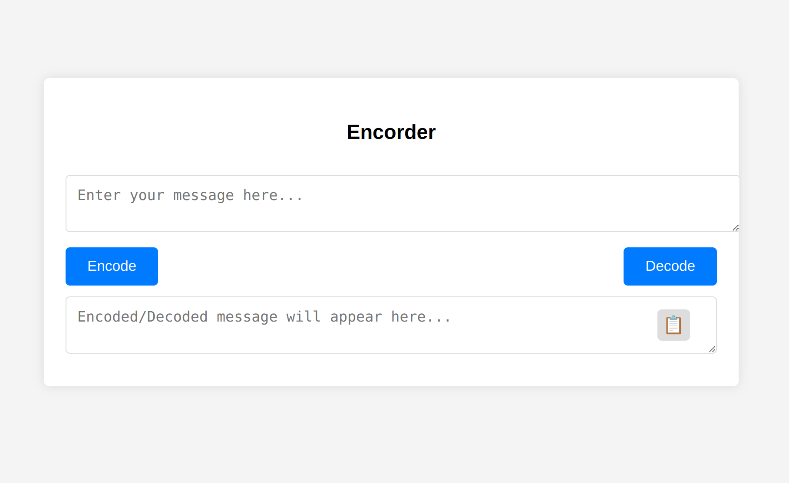

# Encoder & Decoder Web Application

The Encoder & Decoder is a web application that allows users to encode plain text into a serialized non-readable format and then decode it back into its original form. This tool is built using HTML, CSS, and JavaScript.

# Encoder & Decoder Screenshot

# Features

Encode Text: Converts user-provided plain text into a non-readable serialized format.
Decode Text: Converts encoded text back into its original readable form.
Copy to Clipboard: Users can easily copy the encoded/decoded text with a single click.

# Usage

Enter Text: Type or paste the message you want to encode in the provided text area.
Encode: Click the "Encode" button to convert your message into a serialized format.
Decode: To decode, enter the serialized text and click the "Decode" button. The original message will be displayed.
Copy to Clipboard: After encoding or decoding, you can click the 📋 icon to copy the result to your clipboard.

# Installation

Clone the repository or download the source code.
Navigate to the project folder and open index.html in a web browser.

# Contributions

This is an open-source project. Contributions, feedback, and suggestions are welcome!

# License

MIT License. See LICENSE for more details.
